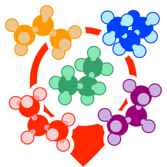

<!-- Improved compatibility of back to top link: See: https://github.com/othneildrew/Best-README-Template/pull/73 -->
<a name="readme-top"></a>


<!-- PROJECT LOGO -->
<br />
<div align="center">
  <a href="https://github.com/yymmt742/mobbrmsd">
    
  </a>

<h3 align="center">mobbrmsd</h3>

  <p align="center">
    An algorithm for efficient superposition and clustering of molecular assemblies using branch-and-bound method.
    <br />
<!--
    <a href="https://github.com/yymmt742/mobbrmsd"><strong>Explore the docs »</strong></a>
    <br />
-->
    <br />
    <a href="https://github.com/yymmt742/mobbrmsd/issues/new?labels=bug&template=bug-report---.md">Report Bug</a>
    ·
    <a href="https://github.com/yymmt742/mobbrmsd/issues/new?labels=enhancement&template=feature-request---.md">Request Feature</a>
  </p>
</div>


<!-- TABLE OF CONTENTS -->
<details>
  <summary>Table of Contents</summary>
  <ol>
    <li>
      <a href="#about-the-project">About The Project</a>
    </li>
    <li>
      <a href="#getting-started">Getting Started</a>
      <ul>
        <li><a href="#prerequisites">Prerequisites</a></li>
        <li><a href="#installation">Installation</a></li>
      </ul>
    </li>
    <li><a href="#usage">Usage</a></li>
    <li><a href="#background">Background</a></li>
    <li><a href="#benchmark">Benchmark</a></li>
    <li><a href="#roadmap">Roadmap</a></li>
    <li><a href="#license">License</a></li>
    <li><a href="#contributing">Contributing</a></li>
    <li><a href="#contact">Contact</a></li>
    <li><a href="#reference">Reference</a></li>
  </ol>
</details>


<!-- ABOUT THE PROJECT -->
# About The Project

[](https://github.com/yymmt742/mobbrmsd/actions/workflows/ci.yml)
[](https://github.com/yymmt742/mobbrmsd/actions/workflows/create_release.yml)

Root mean squared deviation (RMSD) is one of the most common metrics
for comparing the similarity of three-dimensional chemical structures.
The molecular-oriented RMSD with branch-and-bound (mobbRMSD) is an RMSD-based metric for 3D chemical structure similarity.
mobbRMSD is formulated in molecular-oriented coordinates
and uses the branch-and-bound method to obtain an exact solution.
It can handle large and complex chemical systems such as molecular liquids, solvationsof solute, and self-assembly of large molecules,
which are difficult to handle using conventional methods.

Define molecular oriented coordinates as follows:
```math
  \mathbf{X}
  =
  \left\{
  \mathbf{X}_{1},\mathbf{X}_{2},\ldots,\mathbf{X}_{K}
  \right\},
```
where $\mathbf{X}\_I\in\mathbb{R}^{d\times n^{k}\times M^{k}}$ is coordinates of the $k$-th homologous molecular assemblies,
$d$ is a number of spatial dimentions,
and $M^{k}$ and $n^{k}$ are a number of molecules and the number of atoms per molecule, respectively,

For a molecular-oriented coordinate pair $\mathbf{X}$ and $\mathbf{X}'$ that consisting of $M$ molecules of $n$ atoms,
the moRMSD is defined as follows:
```math
  \text{moRMSD}\left(\mathbf{X},\mathbf{X}'\right)
  =
  \min_{\mathbf{R},c,\mu^{(k)},\nu_{I}^{(k)}}
  \sqrt{\frac{1}{\sum_{k=1}^{K}M^{(k)}n^{(k)}} \sum_{k=1}^{K} \sum_{I=1}^{M^{(k)}} \sum_{j=1}^{n^{(k)}} \left\|{x}^{(k)}_{j,I}-\mathbf{R}{{x}'}^{(k)}_{\nu^{(k)}_{I}(j),\mu^{(k)}(I)}-{c}\right\|^2},
```
where $x^{(k)}\_{j,I}$ and ${x'}^{(k)}\_{j,I}$ are the Cartesian coordinates of $j$-th atom in the $I$-th molecule of molecular species $k$
corresponding to $\mathbf{X}$ and $\mathbf{X}'$, respectively,
$c$ is a translation vecotor, and $\mathbf{R}$ is a rotation matrix.
$\nu^{(k)}\_{I}$ and $\mu^{(k)}$ are permutations on
$\\{1,\ldots,n^{(k)}\\}$
and
$\\{1,\ldots,{M}^{(k)}\\}$,
respectively.
$\nu^{(k)}\_{I}$ takes the appropriate domain of definition corresponding to the molecular topology.
Since $\nu^{(k)}\_{I}$ and $\mu^{(k)}$ expand the solution space by factorial and exponential costs with respect to $M^{(k)}$, respectively,
It is difficult to find a solution by brute force when the number of molecules is large.

mobbRMSD practically eliminates this difficulty by using the branch-and-bound method.
See Back Ground and Benchmark for details.

<p align="right">(<a href="#readme-top">back to top</a>)</p>

<!-- GETTING STARTED -->
## Getting Started

### Prerequisites

* gfortran >= 9.4.0
* OpenBLAS (optional)
* OpenMP (optional)

To use the Python interface, you additionally need the following:
* python >= 3.8
* pip

### Installation

   You can use package build via
   ```sh
   pip install git+https://github.com/yymmt742/mobbrmsd.git
   ```
   Running some demonstrations via
   ```sh
   python -m mobbrmsd demo
   ```

<p align="right">(<a href="#readme-top">back to top</a>)</p>

## Usage

   The input is json format, and a simple example is as follows
   ```json
   {
     "reference":"./path/to/file1.pdb",
     "target":"./path/to/file2.xyz",
     "mols":[
       {
        "n_apm":2,
        "n_mol":1,
        "name":"HydrogenFluoride"
       },
       {
        "n_apm":3,
        "n_mol":4,
        "sym":[[ 1, 3, 2]],
        "name":"Water"
       }
     ]
   }
   ```
   In this example, the system contains one hydrogen fluoride and four waters.
   Intramolecular permutations resulting from the swapping of hydrogen positions are specified for water molecules.
   sym is a list of index arrays (list[int]) enumerating the intramolecular permutations represented by substitutions.
   Identity permutation (i.e., [0,1,... n_apm-1]) are ignored if you input it.
   
   The file load backend is [MDtraj](https://mdtraj.org/1.9.4/api/generated/mdtraj.load.html).
   See [documentation](https://mdtraj.org/1.9.4/api/generated/mdtraj.load.html) for supported formats.
   Only coordinates are referenced from the file; information such as residues and atom types are not used.
   The coordinates must have Cartesian coordinates in the order specified in json file as follows.
   ```sh
   > cat file1.pdb
   ATOM      1  F   HF  A   0       X.XXX   Y.YYY   Z.ZZZ  1.00  0.00           F
   ATOM      2  H   HF  A   0       X.XXX   Y.YYY   Z.ZZZ  1.00  0.00           H
   ATOM      3  OH  HF  A   1       X.XXX   Y.YYY   Z.ZZZ  1.00  0.00           O
   ATOM      4  H1  WAT A   1       X.XXX   Y.YYY   Z.ZZZ  1.00  0.00           H
   ATOM      5  H2  WAT A   1       X.XXX   Y.YYY   Z.ZZZ  1.00  0.00           H
   ATOM      6  OH  WAT A   2       X.XXX   Y.YYY   Z.ZZZ  1.00  0.00           O
   ATOM      7  H1  WAT A   2       X.XXX   Y.YYY   Z.ZZZ  1.00  0.00           H
   ATOM      8  H2  WAT A   2       X.XXX   Y.YYY   Z.ZZZ  1.00  0.00           H
   ATOM      9  OH  WAT A   3       X.XXX   Y.YYY   Z.ZZZ  1.00  0.00           O
   ATOM     10  H1  WAT A   3       X.XXX   Y.YYY   Z.ZZZ  1.00  0.00           H
   ATOM     11  H2  WAT A   3       X.XXX   Y.YYY   Z.ZZZ  1.00  0.00           H
   ATOM     12  OH  WAT A   4       X.XXX   Y.YYY   Z.ZZZ  1.00  0.00           O
   ATOM     13  H1  WAT A   4       X.XXX   Y.YYY   Z.ZZZ  1.00  0.00           H
   ATOM     14  H2  WAT A   4       X.XXX   Y.YYY   Z.ZZZ  1.00  0.00           H  
   ```

  You can run the calculations with the following commands:
  
   ```sh
   python -m mobbrmsd run -i <input>
   ```

<p align="right">(<a href="#readme-top">back to top</a>)</p>

## Background


<p align="right">(<a href="#readme-top">back to top</a>)</p>

## Benchmark

<p align="right">(<a href="#readme-top">back to top</a>)</p>

## Roadmap

- [x] Add Usage
- [x] Enable autovariance sorting
- [ ] Enable skip tree
- [ ] Compatible with compilers (intel)
- [x] Compatible with compilers (nv)
- [ ] Add detail documentation
- [ ] Add detail documentation (Python interface)
- [ ] Add benchmarks
- [x] Internalize lapack

See the [open issues](https://github.com/yymmt742/mobbrmsd/issues) for a full list of proposed features (and known issues).

<p align="right">(<a href="#readme-top">back to top</a>)</p>

<!-- CONTRIBUTING -->
## Contributing

This project is open source and we invite contributions.
If you have a suggestion that would make this better,
please fork the repo and create a pull request.

1. Fork the Project
2. Create your Feature Branch (`git checkout -b feature/AmazingFeature`)
3. Commit your Changes (`git commit -m 'Add some AmazingFeature'`)
4. Push to the Branch (`git push origin feature/AmazingFeature`)
5. Open a Pull Request

<p align="right">(<a href="#readme-top">back to top</a>)</p>

<!-- LICENSE -->
## License

Distributed under the MIT License.
See `LICENSE.txt` for more information.

<p align="right">(<a href="#readme-top">back to top</a>)</p>

<!-- CONTACT -->
## Contact

YYMMT742 - yymmt@kuchem.kyoto-u.ac.jp

<p align="right">(<a href="#readme-top">back to top</a>)</p>

<!-- Reference -->
## Reference

Further details are available from the following publications:

* [Yamamoto, Y. "Algorithm for Efficient Superposition and Clustering of Molecular Assemblies Using the Branch-and-Bound Method", _J. Chem. Inf. Model._ __2025__](https://doi.org/10.1021/acs.jcim.4c02217)

This project is based on the following papers:

Molecular superposition

* [Kabsch, W. A solution for the best rotation to relate two sets of vectors. _Acta Crystallogr., Sect. A_ __1976__, 32, 922-923](https://scripts.iucr.org/cgi-bin/paper?S0567739476001873)
* [Theobald, D. L. Rapid calculation of RMSDs using a quaternion-based characteristic polynomial. _Acta Crystallogr., Sect. A_:Found. Crystallogr._ __2005__, 61, 478-480](https://scripts.iucr.org/cgi-bin/paper?S0108767305015266)
* [Coutsias, E. A.; Wester, M. J. RMSD and Symmetry. _J. Comput. Chem._ __2019__, 40, 1496-1508](https://onlinelibrary.wiley.com/doi/10.1002/jcc.25802)

Linear assignment problem

* [Kuhn, H. W. The Hungarian method for the assignment problem. _Naval Res. Logistics Quarterly_ __1955__, 2, 83-97](https://onlinelibrary.wiley.com/doi/10.1002/nav.3800020109)
* [Munkres, J. Algorithms for the Assignment and Transportation Problems. _J. Soc. Ind. Appl. Math._ __1957__, 5, 32-38](http://www.jstor.org/stable/2098689)


<p align="right">(<a href="#readme-top">back to top</a>)</p>

<!-- MARKDOWN LINKS & IMAGES -->
<!-- https://www.markdownguide.org/basic-syntax/#reference-style-links -->

